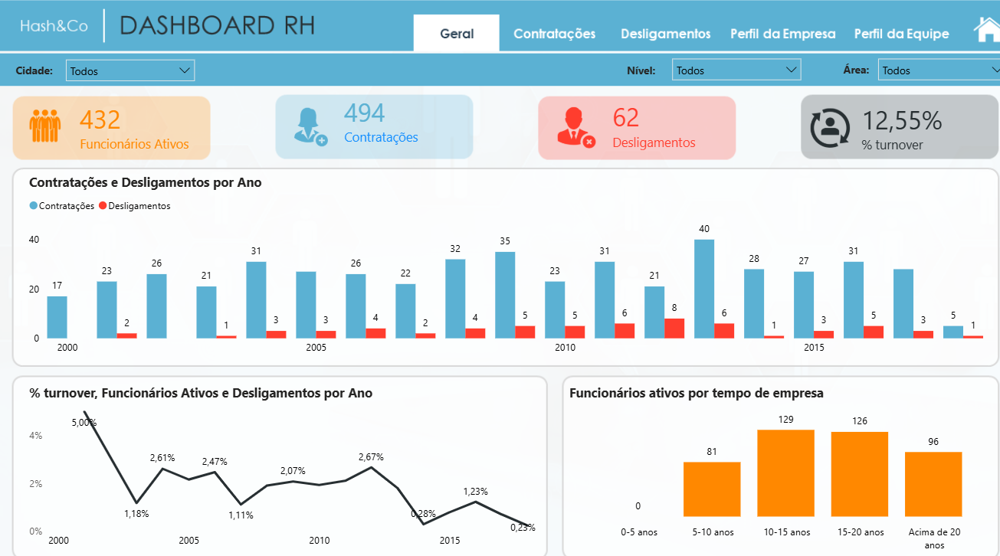
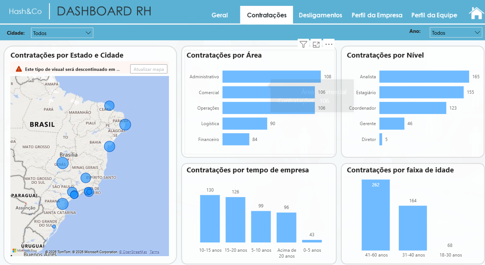
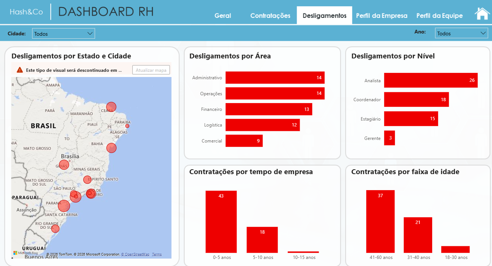
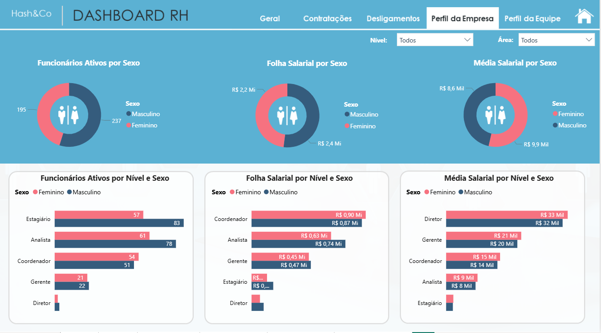

# 👥 Dashboard de People Analytics (RH)

## 📌 Contexto do Negócio
O setor de Recursos Humanos precisa deixar as planilhas estáticas de lado e adotar uma postura analítica. Este projeto tem como objetivo monitorar a saúde organizacional da empresa, acompanhando indicadores vitais de movimentação de pessoal para embasar decisões estratégicas de retenção de talentos e redução de custos.

## 🛠️ Tecnologias Utilizadas
- **Power BI:** Visualização de dados e criação do dashboard interativo.
- **Power Query:** Processo de ETL (Extração, Transformação e Limpeza dos dados).
- **DAX (Data Analysis Expressions):** Criação de medidas calculadas e inteligência de tempo.

## 📊 Principais Indicadores (KPIs)
- **Headcount:** Total de funcionários ativos.
- **Turnover:** Taxa de rotatividade da empresa.
- **Saldo de Movimentação:** Relação direta entre Admissões e Demissões.

## 📸 Capturas de Tela
Abaixo estão as visões detalhadas do dashboard, ilustrando o fluxo de análise e os principais KPIs monitorados.











## 💻 Amostra de Código DAX
Abaixo estão algumas das principais medidas criadas para estabelecer as regras de negócio deste projeto:

```dax
% Homens = 
DIVIDE(
    [Qtd Homens],
    [Total Funcionarios ALL]
)

% turnover = 
DIVIDE(
    [Desligamentos],
    [Funcionários Ativos] + [Desligamentos]
)

Contratações = COUNTROWS(Funcionarios)

// Esta medida conta a quantidade de funcionários contratados, ainda sem levar em consideração os demitidos.

Desligamentos = 
CALCULATE(
    [Contratações],
    Funcionarios[Data de Demissao] <> BLANK(),
    USERELATIONSHIP(Calendario[Data], Funcionarios[Data de Demissao])
)

Folha Salarial = 
SUMX(
    Funcionarios,
    Funcionarios[Salario Base] + Funcionarios[VR] + Funcionarios[VT] + Funcionarios[Impostos] + Funcionarios[Beneficios]
)

Funcionários Ativos = 
CALCULATE(
    [Contratações] - [Desligamentos],
    FILTER(
        ALL(Calendario),
        Calendario[Data] <= MAX(Calendario[Data])
    )
)

Média Salarial = 
AVERAGEX(
    Funcionarios,
    Funcionarios[Salario Base] + Funcionarios[VR] + Funcionarios[VT] + Funcionarios[Impostos] + Funcionarios[Beneficios]
)
